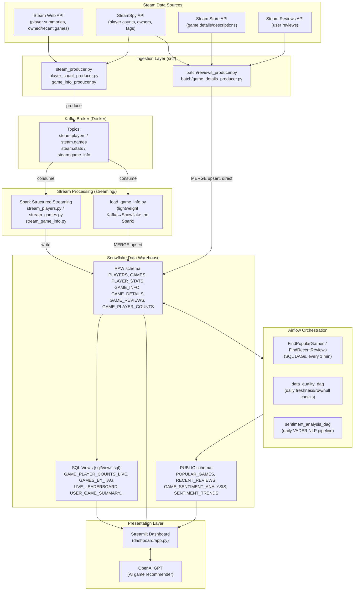

# Steam Analytics Dashboard

A real-time and historical analytics platform for the Steam gaming ecosystem. The project ingests live and batch data from multiple Steam-related APIs, streams it through Kafka and Spark into Snowflake, enriches and validates it with Airflow-orchestrated pipelines, and surfaces the results through an interactive Streamlit dashboard with an AI-powered game recommender.

## Table of Contents

- [Overview](#overview)
- [Demo Videos](#demo-videos)
- [Architecture](#architecture)
- [Role of Each Technology](#role-of-each-technology)
- [Repository Structure](#repository-structure)
- [Dashboard Features](#dashboard-features)
- [Data Pipeline Details](#data-pipeline-details)
- [Prerequisites](#prerequisites)
- [Installation](#installation)
- [Configuration](#configuration)
- [Running the Project](#running-the-project)
- [Database Schema](#database-schema)
- [Known Issues & Notes](#known-issues--notes)

## Overview

Steam Analytics Dashboard combines three complementary data-engineering patterns in one project:

- **Streaming** — live player counts and player/game activity flow continuously through Kafka into Spark Structured Streaming jobs (or a lightweight Kafka-to-Snowflake loader) that land data in Snowflake within seconds to minutes.
- **Batch** — game metadata, descriptions, and reviews are collected in bulk from the Steam Store, Steam Reviews, and SteamSpy APIs and upserted directly into Snowflake on a scheduled cadence.
- **Orchestration** — Apache Airflow coordinates SQL transformations, daily data-quality checks, and an NLP sentiment-analysis pipeline that runs entirely against the Snowflake warehouse.

All of this feeds a Snowflake warehouse queried directly by a Streamlit dashboard, which also calls the OpenAI API to generate natural-language game recommendations.

## Demo Videos

https://github.com/user-attachments/assets/ea59847f-08d6-4e5f-9921-98ba72a1a894

https://github.com/user-attachments/assets/bafa1d81-03e9-4a2e-9cad-5f06e2f4c81e

## Architecture



## Role of Each Technology

| Technology | Role in this project |
|---|---|
| **Apache Kafka** (+ Zookeeper) | Durable, partitioned message bus that decouples data producers from consumers. Four topics (`steam.players`, `steam.games`, `steam.stats`, `steam.game_info`) buffer JSON events produced by the ingestion clients so that Spark (or the lightweight loader) can consume them independently and at its own pace. Run via `confluentinc/cp-kafka` and `confluentinc/cp-zookeeper` Docker images; a **Kafka UI** container (`provectuslabs/kafka-ui`) is included for browsing topics/messages. |
| **Apache Spark (Structured Streaming)** | The core stream-processing engine. `streaming/stream_players.py`, `stream_games.py`, and `stream_game_info.py` each open a `SparkSession`, subscribe to a Kafka topic, parse the JSON payload against an explicit schema, flatten/transform it (timestamp casting, composite key generation via `md5`), and write micro-batches to Snowflake every 30 seconds (`foreachBatch` + the Spark-Snowflake connector). Spark JARs (`spark-sql-kafka-0-10`, `spark-snowflake`, `snowflake-jdbc`) are resolved automatically via `spark.jars.packages`. |
| **Snowflake** | The central, persistent data warehouse and single source of truth. `streaming/snowflake_manager.py` owns schema/table DDL (`PLAYERS`, `GAMES`, `PLAYER_STATS`, `GAME_INFO`, `GAME_DETAILS`, `GAME_REVIEWS`, `GAME_PLAYER_COUNTS`) in the `RAW` schema. SQL views (`sql/views.sql`) compute dashboard-ready aggregates on read (live leaderboard, tag rollups, sentiment summaries, user summaries). Airflow writes derived fact/historical tables into a separate `PUBLIC` schema. Authentication uses RSA key-pair auth (`private_key_file`) rather than passwords. |
| **Apache Airflow** | Batch/orchestration layer running four DAGs against Snowflake directly (via `snowflake.connector` or `SQLExecuteQueryOperator`): two lightweight SQL DAGs that rank popular games and surface recent reviews every minute, a daily **data-quality DAG** that checks table freshness/row counts/null rates and branches to an alert task on failure, and a daily **sentiment-analysis DAG** that extracts unanalyzed reviews, scores them, aggregates game-level sentiment, and computes trending categories (top positive/negative/controversial/most-reviewed). Runs via the official `apache/airflow` Docker Compose stack with a Postgres metadata database. |
| **Streamlit** | Python framework powering the interactive dashboard (`dashboard/app.py`). Uses `st.cache_resource` for the Snowflake connection and `st.cache_data` (with per-query TTLs) to cache query results, and renders five modular sections that each query Snowflake tables/views directly with `pandas.read_sql`. |
| **OpenAI API (GPT-3.5-turbo)** | Powers the "Recommend Me a Game" feature. Given a game's description and genre plus a candidate pool pulled from Snowflake, the LLM is prompted to return 5 similar games as structured JSON with a short rationale for each. Falls back to a SQL tag-similarity query if no API key is configured or the call fails. |
| **VADER Sentiment** (`vaderSentiment`) | Rule-based NLP sentiment analysis library tuned for informal, social-media-style text — well suited to Steam reviews. Used inside `sentiment_analysis_dag` to score each review's polarity (`compound`, `pos`, `neg`, `neu`) and classify it as POSITIVE/NEGATIVE/NEUTRAL. |
| **Docker Compose** | Containerizes and orchestrates infrastructure in two stacks: the root `docker-compose.yaml` (Kafka, Zookeeper, Kafka UI) and `airflow/docker-compose.yaml` (Airflow webserver, scheduler, triggerer, and a Postgres metadata DB). |
| **Pydantic / pydantic-settings** | Typed, environment-variable-driven configuration. `src/utils/settings.py` defines Steam API and Kafka settings; `streaming/snowflake_settings.py` defines Snowflake and Spark settings. Both read from a root `.env` file. |
| **Steam Web API / Steam Store API / Steam Reviews API / SteamSpy API** | The four external data sources. Each has a dedicated client (`src/ingestion/*_client.py`) that self-throttles using the `ratelimit` library's `@sleep_and_retry` / `@limits` decorators to stay within each API's published rate limits. |

## Repository Structure

```
Steam-dashboard/
├── airflow/                        # Airflow orchestration stack
│   ├── config/
│   │   └── snowflake_connection.md #   How to register the Snowflake connection in Airflow
│   ├── dags/
│   │   ├── FindPopularGames.py     #   SQL DAG: top 100 live games -> fact + historical tables (every 1 min)
│   │   ├── FindRecentReviews.py    #   SQL DAG: 5 most recent reviews per game -> fact table (every 1 min)
│   │   ├── data_quality_dag.py     #   Daily freshness / row-count / null-rate checks + alerting
│   │   └── sentiment_analysis_dag.py # Daily VADER sentiment pipeline over GAME_REVIEWS
│   ├── docker-compose.yaml         #   Airflow webserver/scheduler/triggerer + Postgres metadata DB
│   └── requirements.txt
├── dashboard/
│   ├── app.py                      # Streamlit dashboard (main entry point)
│   ├── dashboard_prototyping.py    # Early prototype script (not part of the main app)
│   ├── test_openAI_API.py          # Ad-hoc OpenAI connectivity check
│   ├── test_snowflake_connection.py# Ad-hoc Snowflake connectivity check
│   └── requirements.txt
├── scripts/
│   ├── create_kafka_topics.sh      # Creates the four Kafka topics with retention/compression config
│   └── test_snowflake.py           # Standalone Snowflake key-pair auth connectivity test
├── sql/
│   └── views.sql                   # All dashboard-facing Snowflake views
├── src/
│   ├── batch/
│   │   ├── game_details_producer.py# Batch job: Steam Store details -> Snowflake GAME_DETAILS
│   │   └── reviews_producer.py     # Batch job: Steam Reviews -> Snowflake GAME_REVIEWS
│   ├── ingestion/
│   │   ├── steam_client.py         # Steam Web API client (player summaries, owned/recent games)
│   │   ├── steam_store_client.py   # Steam Store API client (game details)
│   │   ├── steam_reviews_client.py # Steam Reviews API client
│   │   ├── steamspy_client.py      # SteamSpy API client (rankings, tags, owners)
│   │   ├── player_count_client.py  # Official Steam "current players" endpoint client
│   │   ├── kafka_producer.py       # Shared Kafka producer wrapper (topic routing, serialization)
│   │   ├── steam_producer.py       # Continuous Steam Web API -> Kafka producer
│   │   ├── game_info_producer.py   # SteamSpy -> Kafka producer (top / all / continuous modes)
│   │   └── player_count_producer.py# Live player counts -> Snowflake directly (bypasses Kafka)
│   └── utils/
│       ├── logger.py                # YAML-configurable logging setup
│       └── settings.py              # Pydantic settings for Steam API + Kafka
├── streaming/
│   ├── snowflake_manager.py        # Snowflake connection, schema/table DDL, Spark connector options
│   ├── snowflake_settings.py       # Pydantic settings for Snowflake + Spark
│   ├── stream_players.py           # Spark Structured Streaming: steam.players -> PLAYERS
│   ├── stream_games.py             # Spark Structured Streaming: steam.games -> GAMES
│   ├── stream_game_info.py         # Spark Structured Streaming: steam.game_info -> GAME_INFO
│   └── load_game_info.py           # Lightweight Kafka-consumer loader (no Spark/Java required)
├── docker-compose.yaml             # Kafka + Zookeeper + Kafka UI
├── requirements.txt                # Root Python dependencies (ingestion/streaming)
├── run.sh                          # Example command sequence to start the whole stack
├── setup.sh                        # Example one-time environment setup (venv, Java for PySpark)
└── README.md
```

## Dashboard Features

The Streamlit dashboard is organized into five sections, each backed by a different part of the pipeline:

| Section | Data path | Description |
|---|---|---|
| 🎮 **Live Leaderboard** | Streamed (`player_count_producer.py` → `GAME_PLAYER_COUNTS_LIVE` view) | Top games ranked by current player count, refreshed every 5 minutes, with 24h/all-time averages, peaks, and UP/DOWN/STABLE trend indicators. Optional 30s auto-refresh. |
| 🏷️ **Popular Games by Tag** | Batch (`GAMES_BY_TAG` view over `GAME_INFO`) | Browse top games filtered by community tag (Action, RPG, Multiplayer, etc.), ranked by current players. |
| 👤 **User Profile Summary** | Micro-batch (`PLAYERS` / `PLAYER_STATS` join) | Per-user game library with total and recent playtime, joined against genre metadata. |
| 💬 **Game Sentiment Generator** | Airflow batch (`GAME_SENTIMENT_ANALYSIS`, VADER) | Aggregate sentiment score, positive/negative percentages, and sample reviews per game, produced by the daily sentiment DAG. |
| 🎯 **Recommend Me a Game** | AI-powered (OpenAI + `GAME_DETAILS`/`GAME_INFO`) | Select a game you like and get 5 AI-generated recommendations with natural-language reasoning, falling back to a SQL tag-similarity query if the LLM call is unavailable. |

## Data Pipeline Details

The project runs four parallel data-collection lanes that all converge on Snowflake:

1. **Real-time streaming lane (Kafka + Spark)** — `game_info_producer.py` / `steam_producer.py` publish JSON events to Kafka topics; `stream_players.py`, `stream_games.py`, and `stream_game_info.py` consume them with Spark Structured Streaming and write append-only micro-batches to Snowflake every 30 seconds. `load_game_info.py` is a drop-in, Spark-free alternative that consumes the same topic with `kafka-python` and `MERGE`s (upserts) records directly — useful when Java/Spark isn't available.
2. **Micro-batch "most real-time" lane** — `player_count_producer.py` polls the official Steam `GetNumberOfCurrentPlayers` endpoint for the top N games every 5 minutes and writes straight into the `GAME_PLAYER_COUNTS` time-series table, bypassing Kafka entirely. This is what powers the Live Leaderboard.
3. **Batch enrichment lane** — `src/batch/game_details_producer.py` and `src/batch/reviews_producer.py` pull descriptions/genres and reviews for the top N games from the Steam Store and Reviews APIs and `MERGE` them directly into Snowflake. Designed to run periodically (daily) via Airflow or a cron job.
4. **Orchestration & transformation lane (Airflow)** — the four DAGs described above run entirely against Snowflake: two minute-interval SQL DAGs, a daily data-quality DAG, and a daily sentiment-analysis DAG.

Finally, the **presentation layer**: SQL views in `sql/views.sql` compute leaderboards and aggregates on read, and the Streamlit dashboard queries those views/tables directly, layering in OpenAI-generated recommendations.

## Prerequisites

- **Python 3.10+** (PySpark 3.4.0 is used for the streaming jobs)
- **Java (JDK 11 or 17)** — required only for the Spark-based stream processors (`streaming/stream_*.py`). Not needed for the Spark-free `load_game_info.py` path.
- **Docker & Docker Compose** — for Kafka/Zookeeper/Kafka UI and the Airflow stack
- **A Snowflake account** configured for RSA key-pair authentication (an `.p8` private key file)
- **A Steam Web API key** — free, from https://steamcommunity.com/dev/apikey
- **An OpenAI API key** (optional) — only required for the AI-powered game recommender; the dashboard falls back to SQL-based recommendations without it

## Installation

```bash
# 1. Clone the repository
git clone <repository-url>
cd Steam-dashboard

# 2. Create and activate a virtual environment
python3 -m venv .venv
source .venv/bin/activate

# 3. Install Python dependencies
pip install -r requirements.txt            # ingestion / batch / streaming
pip install -r dashboard/requirements.txt   # Streamlit dashboard
pip install openai                          # required by dashboard/app.py but missing from dashboard/requirements.txt
pip install -r airflow/requirements.txt     # only if testing DAG code outside the Airflow containers

# 4. (macOS/Homebrew example) point PySpark at a JDK for the Spark-based streaming jobs
export JAVA_HOME="/opt/homebrew/opt/openjdk@17/libexec/openjdk.jdk/Contents/Home"
export PATH="$JAVA_HOME/bin:$PATH"
```

## Configuration

Create a `.env` file in the repository root. It is loaded automatically by the ingestion and streaming settings modules (`src/utils/settings.py`, `streaming/snowflake_settings.py`), which are case-sensitive about variable names:

```dotenv
# --- Steam API ---
STEAM_API_KEY=your_steam_api_key
STEAM_API_RATE_LIMIT=100

# --- Kafka ---
KAFKA_BOOTSTRAP_SERVERS=localhost:9092
KAFKA_TOPIC_PLAYERS=steam.players
KAFKA_TOPIC_GAMES=steam.games
KAFKA_TOPIC_STATS=steam.stats
KAFKA_TOPIC_GAME_INFO=steam.game_info

# --- Snowflake (note: these three are read in lowercase by streaming/snowflake_settings.py) ---
snowflake_account=your_account_identifier
snowflake_user=your_username
private_key_file=/path/to/rsa_key.p8

# --- Snowflake (uppercase, optional — defaults shown) ---
SNOWFLAKE_DATABASE=STEAM_ANALYTICS
SNOWFLAKE_SCHEMA=RAW
SNOWFLAKE_WAREHOUSE=COMPUTE_WH
SNOWFLAKE_ROLE=ACCOUNTADMIN

# --- Spark ---
SPARK_TRIGGER_INTERVAL=30 seconds
SPARK_CHECKPOINT_LOCATION=/tmp/spark-checkpoints
```

**The Streamlit dashboard and the Airflow DAGs read Snowflake credentials directly from the process environment (`os.environ.get(...)`), not from `.env`.** Before running `streamlit run dashboard/app.py` or executing an Airflow DAG locally, export the same values as real environment variables (e.g. `export SNOWFLAKE_ACCOUNT=...`), or configure the Airflow connection as described in [`airflow/config/snowflake_connection.md`](airflow/config/snowflake_connection.md). Also set `OPENAI_API_KEY` in the environment to enable the AI recommender.

## Running the Project

```bash
# 1. Start Kafka, Zookeeper, and Kafka UI (http://localhost:8080)
docker-compose up -d

# 2. Create the Kafka topics
bash scripts/create_kafka_topics.sh

# 3. Start Airflow (webserver on http://localhost:8081, default login airflow/airflow)
cd airflow && docker-compose up -d && cd ..
# then register the Snowflake connection per airflow/config/snowflake_connection.md

# 4. One-time: create the Snowflake database, schema, and tables
python -c "from streaming.snowflake_manager import setup_snowflake_schema; setup_snowflake_schema()"

# 5. One-time: create the dashboard-facing views in Snowflake
#    Run the contents of sql/views.sql in the Snowflake worksheet / Snowsight / SnowSQL

# 6. Start data ingestion (each runs continuously — use separate terminals/processes)
python -m src.ingestion.game_info_producer --mode continuous
python -m src.ingestion.player_count_producer --interval 5

# 7. Run batch enrichment jobs (periodically, or trigger via Airflow/cron)
python -m src.batch.reviews_producer
python -m src.batch.game_details_producer

# 8. Start the stream processors — choose Spark or the lightweight loader
python streaming/stream_game_info.py &
python streaming/stream_games.py &
python streaming/stream_players.py &
# --- OR, without Spark/Java ---
python streaming/load_game_info.py --continuous --interval 90

# 9. Launch the dashboard
streamlit run dashboard/app.py --server.port 8501
```

## Database Schema

All core tables live in the Snowflake `RAW` schema (created by `streaming/snowflake_manager.py`):

| Table | Populated by | Purpose |
|---|---|---|
| `PLAYERS` | `stream_players.py` | Steam user profiles |
| `GAMES` | `stream_games.py` | Per-user owned-games library |
| `PLAYER_STATS` | Kafka `steam.stats` topic | Recently-played games per user |
| `GAME_INFO` | `stream_game_info.py` / `load_game_info.py` | Global SteamSpy game metadata (owners, tags, CCU, pricing) |
| `GAME_DETAILS` | `src/batch/game_details_producer.py` | Steam Store descriptions, genres, metacritic score |
| `GAME_REVIEWS` | `src/batch/reviews_producer.py` | Individual Steam reviews |
| `GAME_PLAYER_COUNTS` | `player_count_producer.py` | Time-series of live player counts (feeds the leaderboard) |

Airflow adds derived tables in a `PUBLIC` schema (`POPULAR_GAMES`, `POPULAR_GAMES_HISTORICAL`, `RECENT_REVIEWS`) and sentiment tables in `RAW` (`REVIEW_SENTIMENTS`, `GAME_SENTIMENT_ANALYSIS`, `SENTIMENT_TRENDS`). Dashboard-facing views (`GAME_PLAYER_COUNTS_LIVE`, `GAMES_BY_TAG`, `LIVE_LEADERBOARD`, `TOP_GAMES_BY_TAG`, `USER_GAME_SUMMARY`, `GAME_SENTIMENT_SUMMARY`, `GAME_PLAYER_COUNTS_TIMESERIES`) are defined in `sql/views.sql`.

## Known Issues & Notes

- ⚠️ **Rotate the Snowflake key immediately**: `streaming/snowflake_manager.py` currently contains a hardcoded RSA private key. Treat it as compromised, rotate/revoke it in Snowflake, and load keys only from a gitignored file or a secrets manager going forward.
- The `openai` package is used by `dashboard/app.py` but is not listed in `dashboard/requirements.txt` — install it manually (see Installation above).
- Snowflake env var naming is inconsistent across the codebase: `streaming/snowflake_settings.py` requires lowercase `snowflake_account` / `snowflake_user` / `private_key_file`, while `dashboard/app.py` and the Airflow DAGs read uppercase `SNOWFLAKE_ACCOUNT` / `SNOWFLAKE_USER` / `SNOWFLAKE_PRIVATE_KEY_FILE`. Set both forms in your environment if you're running the full stack.
- `airflow/dags/FindPopularGames.py` and `FindRecentReviews.py` have `CONNECTION_ID = ""`; set this to a real Airflow connection id (e.g. `snowflake_default`) before enabling those DAGs.
- `run.sh` references a `docker` subfolder that doesn't exist in this repo — the Kafka stack's `docker-compose.yaml` lives at the repository root (see the corrected commands above).
- `dashboard/dashboard_prototyping.py`, `test.py`, and `tmp.py` are early prototypes/scratch scripts kept for reference; they are not part of the main pipeline and are not required to run the dashboard.
